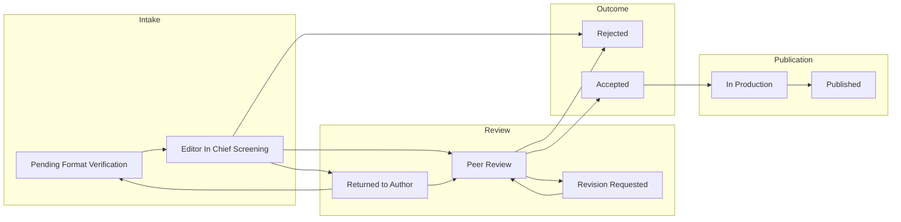

# JESAM Editorial Management System (CMSC 191 Project)

## Project overview

JESAM (Journal of Environmental Science and Management) Editorial Management System is a class project that digitizes the editorial workflow: manuscript submission, handling-editor checks, Editor-in-Chief screening, peer review, revisions, production, and public discovery.

### Tech stack

- **Frontend:** React, Vite, Tailwind CSS, TypeScript
- **Backend:** Supabase (PostgreSQL, Auth, Storage)

### Current state

- **Authentication:** Supabase Auth with role-based access via `public.profiles`.
- **Routing:** Protected routes per role; public article and browse routes without app shell.
- **Data:** Manuscript lifecycle, relational peer review, revision versions, publication pipeline, and metrics are wired in code and migrations.

---

## Local setup

1. **Clone the repository**
   ```bash
   git clone <repository-url>
   cd JESAM
   ```

2. **Install dependencies**
   ```bash
   npm install
   ```

3. **Environment variables**  
   See [Environment variables](#environment-variables). Never commit `.env` or `.env.local`.

4. **Run the app**
   ```bash
   npm run dev
   ```
   Open `http://localhost:5173`.

5. **Database**  
   Apply SQL in `supabase/migrations/` to your Supabase project (CLI or SQL Editor) so RLS and tables match the app.

---

## Environment variables

> **Do not commit** `.env` or `.env.local` (keys must stay private).

Place `.env.local` in the project root (next to `package.json`). Typical keys include your Supabase URL and anon key (see team chat or project owner for the shared file).

### Supabase profile row on sign-up

Registration sends metadata (e.g. `role`, and for reviewers `review_expertise`) via `auth.signUp`. Your **`on_auth_user_created`** trigger on `public.profiles` should copy those fields from `raw_user_meta_data`. If `review_expertise` stays `NULL` for reviewers, update the trigger (see migration `supabase/migrations/20260502120000_profiles_reviewer_expertise.sql`).

---

## Repository layout (`src/`)

```text
src/
├── components/          # Shared UI (layout, auth, status badges, PDF viewer)
├── contexts/            # AuthContext
├── lib/                 # Supabase client, manuscripts-db, peer-review-db, revision-db, workflow helpers
├── modules/
│   ├── auth/            # Login, Register
│   ├── submission/      # Author submit, editor format queue, EIC screening
│   ├── peer-review/     # Editorial peer-review dashboard, reviewer portal
│   ├── revision/        # Author revision uploads, editor post-revision round cues
│   ├── publication-impact/  # Production dashboard, article detail, publish flow
│   ├── journals-dashboard/  # Public browse (/browse)
│   ├── analytics-dashboard/
│   └── ai-chatbot/
├── router.tsx           # All routes and role guards
├── types.ts             # ManuscriptStatus, Manuscript, workflow types (single source of truth)
└── ...
```

**Navigation and roles:** [`src/lib/nav-permissions.ts`](src/lib/nav-permissions.ts), [`src/lib/workspace-routing.ts`](src/lib/workspace-routing.ts).

---

## End-to-end workflow (submission → publication)

Statuses are defined in [`src/types.ts`](src/types.ts) as `ManuscriptStatus`. Typical happy path:



| Stage | Status (examples) | Who acts | Main routes | Key code |
| --- | --- | --- | --- | --- |
| Submit | `Pending Format Verification` | Author | `/author`, `/author/submit` | [`useSubmissions.ts`](src/modules/submission/hooks/useSubmissions.ts), [`SubmissionWorkflow.tsx`](src/modules/submission/pages/SubmissionWorkflow.tsx) |
| Format check | `Pending Format Verification` → approve → `Editor In Chief Screening`; return → `Returned to Author` | Associate / managing editor | `/submission/queue` | [`EditorDashboard.tsx`](src/modules/submission/pages/EditorDashboard.tsx), [`EditorVerificationTable.tsx`](src/modules/submission/components/EditorVerificationTable.tsx) |
| Screening | `Editor In Chief Screening` → proceed / return / reject | Editor-in-Chief | `/submission/screening` | [`EditorInChiefDashboard.tsx`](src/modules/submission/pages/EditorInChiefDashboard.tsx), [`EditorInChiefScreening.tsx`](src/modules/submission/components/EditorInChiefScreening.tsx), [`ScreeningDecisionModal.tsx`](src/modules/submission/components/ScreeningDecisionModal.tsx) |
| Peer review | `Peer Review`, `Revision Requested` | Editorial staff, reviewers | `/peer-review`, `/peer-review/reviewer` | [`usePeerReview.ts`](src/modules/peer-review/hooks/usePeerReview.ts), [`PeerReviewDashboard.tsx`](src/modules/peer-review/pages/PeerReviewDashboard.tsx), [`ReviewerPortal.tsx`](src/modules/peer-review/pages/ReviewerPortal.tsx) |
| Revision | `Revision Requested`, `Returned to Author` | Author (+ editors for extensions) | `/revision` | [`useRevision.ts`](src/modules/revision/hooks/useRevision.ts), [`RevisionDashboard.tsx`](src/modules/revision/pages/RevisionDashboard.tsx) |
| Accept | `Accepted` | Editor (decision from peer review) | `/peer-review` | `makeEditorialDecision` in [`usePeerReview.ts`](src/modules/peer-review/hooks/usePeerReview.ts) |
| Production | `Accepted`, `In Production`, `Published`, `Retracted`, legacy `Return to Revision` | Production editor | `/publication/dashboard`, `/article/:id` | [`useManuscripts.ts`](src/modules/publication-impact/hooks/useManuscripts.ts), [`PublicationDashboard.tsx`](src/modules/publication-impact/pages/PublicationDashboard.tsx), [`ArticleDetail.tsx`](src/modules/publication-impact/pages/ArticleDetail.tsx) |
| Public read | `Published` | Anyone | `/browse`, `/article/public/:id` | [`JournalsDashboard.tsx`](src/modules/journals-dashboard/pages/JournalsDashboard.tsx), [`PublicArticlePage.tsx`](src/modules/publication-impact/pages/PublicArticlePage.tsx), [`listPublishedManuscriptsPublic`](src/lib/manuscripts-db.ts) |

**Intake resubmit:** If the author is in `Returned to Author` and peer review has not started in the database, submitting a revision routes back to `Pending Format Verification` (not straight to `Peer Review`). See `submitRevision` in [`useRevision.ts`](src/modules/revision/hooks/useRevision.ts).

**Post–peer-review revision:** After the author resubmits, status returns to `Peer Review`. The editorial dashboard can prompt **Start post-revision peer-review round** when the prior round has a recorded decision and a new round is needed; see `manuscriptNeedsEditorToStartPostRevisionRound` in [`useRevision.ts`](src/modules/revision/hooks/useRevision.ts) and [`PeerReviewDashboard.tsx`](src/modules/peer-review/pages/PeerReviewDashboard.tsx).

**Production return for revision:** Returning from production sets status to `Revision Requested` (same queue as editorial revision). After the author resubmits, the manuscript goes back to `Peer Review` per `submitRevision`.

---

## Roles and routes (quick reference)

Full routing lives in [`src/router.tsx`](src/router.tsx).

| Role | Primary workspace entry |
| --- | --- |
| `author` | `/author` |
| `associate_editor`, `managing_editor` | `/` → workspace home; `/submission/queue`, `/peer-review`, `/revision`, `/analytics` |
| `editor_in_chief` | `/submission/screening`, `/peer-review`, `/revision`, `/analytics` |
| `reviewer` | `/peer-review/reviewer` |
| `production_editor` | `/publication/dashboard`, `/article/:id` |
| `system_admin` | Union of internal routes (see `nav-permissions`) |

**Public (no app shell):** `/browse`, `/article/public/:id`, `/login`, `/register`.

---

## Database and backend notes

- **Manuscripts:** `public.manuscripts` — status, `submitter_id`, `submission_metadata` (JSON: notifications, audit logs, merged peer-review view, etc.).
- **Peer review (relational):** `peer_review_rounds`, `reviewer_invitations`, `review_submissions` — see [`src/lib/peer-review-db.ts`](src/lib/peer-review-db.ts) and migrations under `supabase/migrations/`.
- **Revisions:** `manuscript_revision_versions` — see [`src/lib/revision-db.ts`](src/lib/revision-db.ts).
- **Published discovery:** `/browse` loads `status = 'Published'` via [`listPublishedManuscriptsPublic`](src/lib/manuscripts-db.ts). RLS must allow all authenticated users (and optionally anonymous users) to `SELECT` published rows; see `supabase/migrations/20260510100000_manuscripts_published_select_policy.sql`.

Workflow helpers (notifications, audit append, peer-review JSON helpers): [`src/lib/workflow.ts`](src/lib/workflow.ts).

---

## Testing and QA

- **Manual end-to-end checklist:** [`docs/E2E_TESTING_FLOW.md`](docs/E2E_TESTING_FLOW.md) — phases from submission through publication and browse.

---

## Development guidelines

1. **Feature modules** — Add work under `src/modules/<your-feature>/` with `pages/`, `components/`, `hooks/` as needed. Do not pile unrelated pages into a single flat folder.
2. **Types** — Use [`src/types.ts`](src/types.ts) for manuscripts and shared shapes; avoid duplicating core interfaces in modules.
3. **Styling** — Prefer Tailwind utility classes.

---

## Simulation / scope notes

Some integrations are intentionally lightweight or manual in this codebase (e.g. assistive checks, parts of DOI/deposit flows, chatbot content). Treat production keys and real provider contracts as out-of-band configuration.
