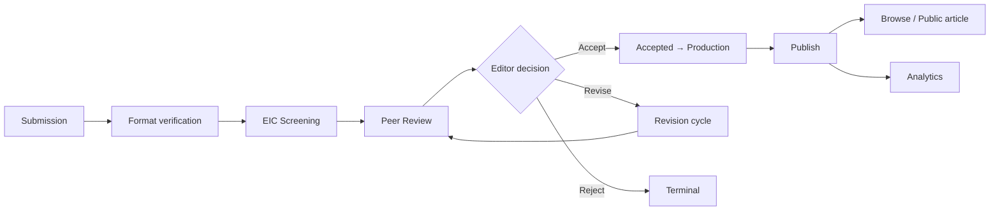

# End-to-end testing flow (submission → publication → analytics)

This document describes a **canonical manual test path** through JESAM modules, aligned with the **canonical lifecycle** in [`TRANSCRIPT_TRACEABILITY.md`](./TRANSCRIPT_TRACEABILITY.md) (transcript-first + proposal): screening authority, in-system peer review, versioned revision, production readiness, public discovery, assistive AI, and auditable notifications.

Use it to verify behavior matches intent—not as automated test code.

---

## How to use this guide

1. ** Preconditions:** Working Supabase project, env vars loaded, `npm run dev` (or staging build), and seed data if your DB is empty.
2. **Roles:** The full lifecycle spans multiple roles. Easiest path is **`system_admin`** (union access in [`src/lib/nav-permissions.ts`](../src/lib/nav-permissions.ts) + [`src/router.tsx`](../src/router.tsx)); otherwise switch accounts between **author**, **editor_in_chief**, **associate_editor** / **managing_editor**, **reviewer** (email must match invited reviewer), and **production_editor**.
3. **Evidence:** After each phase, spot-check `submission_metadata.notifications` / `audit_logs` on the manuscript row (Supabase or in-app detail views where surfaced).

---

## Canonical lifecycle (reference)

---

## Phase 1 — Submission module

| Item              | Detail                                                                                                                                                                                                                                                                                                                                                                                                                                  |
| ----------------- | --------------------------------------------------------------------------------------------------------------------------------------------------------------------------------------------------------------------------------------------------------------------------------------------------------------------------------------------------------------------------------------------------------------------------------------- |
| **Goal**          | Author completes gated wizard; manuscript lands in **Pending Format Verification** with checks + declarations captured.                                                                                                                                                                                                                                                                                                                 |
| **Route**         | `/author` → `/author/submit`                                                                                                                                                                                                                                                                                                                                                                                                            |
| **Primary pages** | [`SubmissionDashboard.tsx`](../src/modules/submission/pages/SubmissionDashboard.tsx), [`SubmissionWorkflow.tsx`](../src/modules/submission/pages/SubmissionWorkflow.tsx)                                                                                                                                                                                                                                                                |
| **Supporting UI** | [`MetadataForm.tsx`](../src/modules/submission/components/MetadataForm.tsx), [`AuthorInformation.tsx`](../src/modules/submission/components/AuthorInformation.tsx), [`AutomatedChecks.tsx`](../src/modules/submission/components/AutomatedChecks.tsx), [`AdministrativeCheck.tsx`](../src/modules/submission/components/AdministrativeCheck.tsx), [`SubmissionSuccess.tsx`](../src/modules/submission/components/SubmissionSuccess.tsx) |
| **State / API**   | [`SubmissionWizardContext.tsx`](../src/modules/submission/context/SubmissionWizardContext.tsx), [`useSubmissions.ts`](../src/modules/submission/hooks/useSubmissions.ts) (`createManuscript`)                                                                                                                                                                                                                                           |

### Steps (happy path)

1. Sign in as **author** (or admin acting as author if your auth allows).
2. Open **Submission** → **New submission** (`/author/submit`).
3. Complete steps in order: **metadata** → **authors** → **automated checks** → **author declarations**, advancing only when validation passes (`canProceed` in `SubmissionWorkflow.tsx`).
4. Upload the manuscript file on the final step before submit (required).
5. Submit and confirm success screen; note **reference code / id**.

### Verify

- New row exists with `status: "Pending Format Verification"` (see `createManuscript` in `useSubmissions.ts`).
- Simulated checks and declarations are stored in submission metadata as designed.
- Success screen ([`SubmissionSuccess.tsx`](../src/modules/submission/components/SubmissionSuccess.tsx)) shows **Format verification** as the next step; in-app notification (`submission-received`) describes handling editor then EIC.

### Why this shape (transcript + proposal)

- **Transcript:** Avoid bypassing desk screening; capture similarity/template-style checks before progression.
- **Proposal:** Structured metadata, author transparency (ORCID/affiliations), and gating before editorial review.
- **Implementation:** Wizard steps enforce ordering; file required at submit so production never receives empty shells.

---

## Phase 1b — Handling editor format verification

| Item              | Detail                                                                                                                                                                        |
| ----------------- | ----------------------------------------------------------------------------------------------------------------------------------------------------------------------------- |
| **Goal**          | **Associate / managing editor** (or admin on `/submission/queue`) verifies automated checks and PDF; clears manuscript to **Editor In Chief Screening** or returns to author. |
| **Route**         | `/submission/queue`                                                                                                                                                           |
| **Primary page**  | [`EditorDashboard.tsx`](../src/modules/submission/pages/EditorDashboard.tsx)                                                                                                  |
| **Supporting UI** | [`EditorVerificationTable.tsx`](../src/modules/submission/components/EditorVerificationTable.tsx), [`EditorView.tsx`](../src/modules/submission/components/EditorView.tsx)    |
| **State / API**   | [`useSubmissions.ts`](../src/modules/submission/hooks/useSubmissions.ts) — `recordEditorVerification`                                                                         |

### Steps (happy path — clear to EIC)

1. Sign in as **associate_editor**, **managing_editor**, or **system_admin**.
2. Open `/submission/queue`; confirm the new manuscript appears in **Pending format verification**.
3. Open **Review**, confirm automated check snapshot + PDF, then **Approve** (→ status **`Editor In Chief Screening`**).

### Branch (return to author)

1. From the same review screen, **Return** with comments → status **`Returned to Author`** (`editor_verification_comments` in metadata).
2. Sign in as **author** → **`/revision`**; use the **Intake resubmission** banner copy when applicable ([`RevisionDashboard.tsx`](../src/modules/revision/pages/RevisionDashboard.tsx), [`intakeReturnedAuthorResubmitGoesToFormatQueue`](../src/modules/revision/hooks/useRevision.ts)).
3. Upload a revised PDF; pass **automated checks**; submit.
4. Verify status returns to **`Pending Format Verification`** (not **`Peer Review`**) while **no** relational `peer_review_rounds` rows exist ([`manuscriptHasPeerReviewRoundsInDb`](../src/lib/peer-review-db.ts)).

### Why this shape

- **Transcript / proposal:** Template/format validation **before** external peer review; handling editor gate before EIC.

---

## Phase 2 — EIC screening

| Item              | Detail                                                                                                                                                                           |
| ----------------- | -------------------------------------------------------------------------------------------------------------------------------------------------------------------------------- |
| **Goal**          | Only **EIC** (or admin) issues desk decisions; outcomes move work to peer review, return to author, or reject. Manuscripts appear here **after** format verification is cleared. |
| **Route**         | `/submission/screening`                                                                                                                                                          |
| **Primary page**  | [`EditorInChiefDashboard.tsx`](../src/modules/submission/pages/EditorInChiefDashboard.tsx)                                                                                       |
| **Supporting UI** | [`EditorInChiefScreening.tsx`](../src/modules/submission/components/EditorInChiefScreening.tsx)                                                                                  |
| **State / API**   | [`useSubmissions.ts`](../src/modules/submission/hooks/useSubmissions.ts) — `recordScreeningDecision`                                                                             |

### Steps (proceed to peer review)

1. Sign in as **editor_in_chief** or **system_admin** (screening route allows both per `router.tsx`).
2. Open `/submission/screening`; confirm the manuscript appears under screening (post–format verification).
3. Apply decision **Approve / send to peer review** (maps to `decision === "approve"` → status **`Peer Review`**).

### Verify

- Status becomes **`Peer Review`**.
- `submission_metadata` gains screening comments, timestamps, **notification** (`screening-decision`), and **audit** entry (`screening-decision`).

### Branch decisions (also test)

- **Reject** → `Rejected`; optional `rejection_reason` path in metadata.
- **Return to author** → `Returned to Author`; aligns with transcript “desk return” before full review. If the manuscript has **not** yet entered external peer review (no rows in `peer_review_rounds`), the author’s resubmission from **`/revision`** routes back to **`Pending Format Verification`** (same rule as Phase 1b return)—see [`useRevision.ts`](../src/modules/revision/hooks/useRevision.ts) (`submitRevision` + [`manuscriptHasPeerReviewRoundsInDb`](../src/lib/peer-review-db.ts)).

### Why this shape

- **Transcript:** EIC owns initial screening; not delegated to authors or reviewers.
- **Implementation:** `recordScreeningDecision` centralizes status + metadata + notifications + audit in one write.

### Related monitoring

- EIC dashboard shows a **Pending format verification** count for situational awareness; actions for that queue live on **`/submission/queue`**.

---

## Phase 3 — Peer review (editorial operations)

| Item             | Detail                                                                                                                                                                                                  |
| ---------------- | ------------------------------------------------------------------------------------------------------------------------------------------------------------------------------------------------------- |
| **Goal**         | Editors run an **in-system** round: invitations, reminders, structured reviews, minimum reviewer target, editorial consolidation.                                                                       |
| **Route**        | `/peer-review`                                                                                                                                                                                          |
| **Primary page** | [`PeerReviewDashboard.tsx`](../src/modules/peer-review/pages/PeerReviewDashboard.tsx)                                                                                                                   |
| **Core logic**   | [`workflow.ts`](../src/lib/workflow.ts) (`PEER_REVIEW_TARGET_COUNT = 3`, `ensurePeerReviewRound`, `inviteReviewer`, `submitReview`, …), [`reviewer-suggestions.ts`](../src/lib/reviewer-suggestions.ts) |
| **State / API**  | [`usePeerReview.ts`](../src/modules/peer-review/hooks/usePeerReview.ts)                                                                                                                                 |

### Steps

1. Sign in as **associate_editor**, **managing_editor**, **editor_in_chief**, or **system_admin**.
2. Open `/peer-review`; select the manuscript (`Peer Review` or `Revision Requested` appears in hook filter).
3. Initialize peer review round if needed (UI triggers `initializeRound` → `ensurePeerReviewRound` with target **3** submitted reviews to gate a decision per round; **Request additional reviewer** opens a new round with the same minimum).
4. Invite reviewers:
   - Use **AI-assisted suggestions** (ranked by focus expertise) or **Invite top suggested reviewer** / per-row **Invite**.
   - Optional: **Send reminder** on an invitation (`sendReviewReminder` → notification + audit).
5. Minimum gate before editorial decision: **`submittedReviews >= targetReviewerCount`** (`canDecide` in `PeerReviewDashboard.tsx`).

### Verify

- `submission_metadata.peer_review.rounds` contains invitations (due dates), and submissions fill as reviews arrive.
- Notifications + audit logs append on invite, reminder, and decision-related events.

### Why this shape

- **Transcript:** Review workflow should be **in-system**, not email-first.
- **Implementation:** Minimum **three** submitted reviews per round gate the editorial decision (proposal §2.4); **Request additional reviewer** starts a new round with the same per-round minimum.
- **Implementation:** Mock reviewer directory + ranking keeps demos repeatable without external assignment APIs.

---

## Phase 4 — Peer review (reviewer portal)

| Item             | Detail                                                                                                                  |
| ---------------- | ----------------------------------------------------------------------------------------------------------------------- |
| **Goal**         | Reviewers accept/decline invitations and submit structured reviews.                                                     |
| **Route**        | `/peer-review/reviewer`                                                                                                 |
| **Primary page** | [`ReviewerPortal.tsx`](../src/modules/peer-review/pages/ReviewerPortal.tsx)                                             |
| **State / API**  | [`usePeerReview.ts`](../src/modules/peer-review/hooks/usePeerReview.ts) — `respondInvitation`, `submitReviewerFeedback` |

### Steps

1. Sign in as a user whose **`user.email`** matches an invited **`reviewerEmail`** (portal matches invitations by email).
2. Accept invitation when prompted; fill summary / major / minor / confidential / recommendation.
3. Submit review; repeat until at least **three** submitted reviews for the active round (or adjust target only if you intentionally changed seed data).
4. After a successful submit, allow the browser **print** dialog (certificate MVP from [`reviewer-certificate.ts`](../src/lib/reviewer-certificate.ts)); save as PDF if desired.

### Verify

- Invitation status moves to **accepted**; review appears under round **`submissions`**.
- Associate editors receive a **notification** trail entry for review submission (`review-submitted`).
- Certificate window opens with reviewer name, email, manuscript reference, and title.

### Why this shape

- **Transcript:** Structured, traceable reviewer artifacts instead of ad hoc email attachments.
- **Implementation:** Email linkage is the pragmatic identity key for simulated reviewers without a separate reviewer profile table.

---

## Phase 5 — Editorial decision after peer review

| Item            | Detail                                                                                                                                |
| --------------- | ------------------------------------------------------------------------------------------------------------------------------------- |
| **Goal**        | Editor consolidates reviews and transitions manuscript to **accept**, **revise**, **reject**, or **additional reviewer** (new round). |
| **Route**       | `/peer-review` (same dashboard)                                                                                                       |
| **State / API** | [`usePeerReview.ts`](../src/modules/peer-review/hooks/usePeerReview.ts) — `makeEditorialDecision`                                     |

### Steps

1. With **`canDecide === true`**, choose one of:
   - **Accept** → status **`Accepted`** (production pipeline).
   - **Revise** → **`Revision Requested`** (revision module).
   - **Reject** → **`Rejected`**.
   - **Additional reviewer** → stays **`Peer Review`** with incremented round (`ensurePeerReviewRound` after decision).

### Verify

- Status matches decision; `peer_review.rounds[..].editorDecision` fields populated; notifications + audit updated.

### Why this shape

- **Proposal + transcript:** Human editorial control after structured input; optional extra round without losing history.

---

## Phase 6 — Revision cycle

| Item             | Detail                                                                                                                                                                                                                                                                     |
| ---------------- | -------------------------------------------------------------------------------------------------------------------------------------------------------------------------------------------------------------------------------------------------------------------------- |
| **Goal**         | Versioned revision rounds; extensions; return to peer review after author submission; editor opens the **next** review round when further peer review is needed (§2.5).                                                                                                    |
| **Route**        | `/revision` (author) → `/peer-review` (editor)                                                                                                                                                                                                                             |
| **Primary page** | [`RevisionDashboard.tsx`](../src/modules/revision/pages/RevisionDashboard.tsx)                                                                                                                                                                                             |
| **Core logic**   | [`revision-db.ts`](../src/lib/revision-db.ts) — `insertManuscriptRevisionVersion`; [`automated-checks-runner.ts`](../src/lib/automated-checks-runner.ts); [`manuscripts-db.ts`](../src/lib/manuscripts-db.ts) — `uploadRevisionFileToStorage` / `versionedStorageFileName` |
| **State / API**  | [`useRevision.ts`](../src/modules/revision/hooks/useRevision.ts) — `submitRevision` branches on relational peer-review presence; [`usePeerReview.ts`](../src/modules/peer-review/hooks/usePeerReview.ts) — `startPostRevisionPeerReviewRound`                              |

### Steps

**A — Post–peer-review revision (status `Revision Requested`, or `Returned to Author` after review has started)**

1. As **author** (manuscript in **`Revision Requested`** or **`Returned to Author`** with at least one **`peer_review_rounds`** row), open **`/revision`**.
2. Upload a revised PDF; wait for **automated checks** (same simulated intake as new submission); add author note and optional response letter; optional **extension** path for editors (`grantExtension`).
3. On **`submitRevision`**, confirm status returns to **`Peer Review`**; **`file_url`** points at the new object (`*_version_*` in the storage key; relational rows in **`manuscript_revision_versions`** via [`revision-db.ts`](../src/lib/revision-db.ts)).
4. On **`/peer-review`**, if the prior active round has a completed editorial decision (**`revise`**, **`accept`**, or **`reject`**) and the author has submitted a new revision (including production-return flows), the editor uses **Start post-revision peer-review round** when ready for reviewers to assess the new file. Confirm **`peer_review_active_round`** increments and a new **`peer_review_rounds`** row exists for that round.
5. Invite reviewers and collect reviews on the **new** round; record an editorial decision as in Phase 5.

**B — Intake-only resubmit (status `Returned to Author`, no peer review yet)**

1. As **author**, open **`/revision`** (same hook lists `Returned to Author`).
2. Upload revised PDF; pass checks; submit.
3. Confirm status returns to **`Pending Format Verification`** (not **`Peer Review`**). Re-run **Phase 1b** (handling editor) then **Phase 2** (EIC) before **Phase 3**.

### Verify

- Relational revision versions and/or merged `revision_cycle.rounds`; `submission_metadata.automated_checks` and `similarity_score` updated on revision submit; extension grants when used.
- **Path A:** After editor starts the next round (step A4), the active round in the UI matches the **successor** round (empty invitations until invites are sent), not the pre-revision round.
- **Path B:** Notification / audit may record `intake-revision-submitted` and a message that the manuscript is queued for format verification.

### Why this shape

- **Proposal + transcript:** Iterative revision with **version history**, not silent overwrites; deadline flexibility via extension metadata.

---

## Phase 7 — Publication & impact (production)

| Item              | Detail                                                                                                                                                                                                                                                                                                        |
| ----------------- | ------------------------------------------------------------------------------------------------------------------------------------------------------------------------------------------------------------------------------------------------------------------------------------------------------------- |
| **Goal**          | Post-acceptance pipeline: proofing readiness (metadata, file, DOI), optional return-to-revision, publish, metrics.                                                                                                                                                                                            |
| **Route**         | `/publication/dashboard` → internal **`/article/:id`**                                                                                                                                                                                                                                                        |
| **Primary pages** | [`PublicationDashboard.tsx`](../src/modules/publication-impact/pages/PublicationDashboard.tsx), [`ArticleDetail.tsx`](../src/modules/publication-impact/pages/ArticleDetail.tsx)                                                                                                                              |
| **Supporting UI** | [`ReadinessChecklist.tsx`](../src/modules/publication-impact/components/ReadinessChecklist.tsx), [`PublishAction.tsx`](../src/modules/publication-impact/components/PublishAction.tsx), [`ManuscriptCard.tsx`](../src/modules/publication-impact/components/ManuscriptCard.tsx), modals (DOI, file, metadata) |
| **State / API**   | [`useManuscripts.ts`](../src/modules/publication-impact/hooks/useManuscripts.ts) — `getReadinessStatus`, `publishManuscript`, `assignDOI`, `uploadFile`, etc.                                                                                                                                                 |

### Steps

1. Sign in as **production_editor** or **system_admin**.
2. Open `/publication/dashboard`; open a manuscript in **`Accepted`** (from peer-review accept).
3. On **`/article/:id`**, complete **Pre-Publication Checklist**: metadata, PDF **`file_url`**, **DOI** (`ReadinessChecklist` / modals).
4. Use **Publish** when `readiness.isReady` (`publishManuscript`): status → **`Published`**, `published_at` set, notification + audit; **`article_metrics`** row inserted when publish succeeds.
5. Optional: exercise **Return to Revision** from readiness panel (`returnToRevision`): stored status becomes **`Revision Requested`** (same revision-cycle status used by editorial decisions).
6. As **author**, open `/revision`, submit updated files, and verify the manuscript returns to **`Peer Review`** for re-review coordination.

### Verify

- Cannot publish until `getReadinessStatus` returns **`isReady`** (proposal: gated publication).
- UKDR link + XML download triggered from [`PublishAction.tsx`](../src/modules/publication-impact/components/PublishAction.tsx) (assistive institutional deposit path).
- After production return, manuscript appears in the revision queue under **`Revision Requested`**; submitting a revision routes it back to **`Peer Review`**.

### Note on **`In Production`**

- Type system and DB allow **`In Production`** ([`types.ts`](../src/types.ts), publication filters). The main **ArticleDetail** publish path jumps **`Accepted` → `Published`** once readiness passes. If you need to test the **`In Production`** tab on the dashboard explicitly, you may set status via DB/admin tooling—worth noting as a **gap** if the product must enforce that intermediate state in UI only.

### Why this shape

- **Transcript + proposal:** Production/proof checkpoint before public release; DOI and files as readiness gates.

---

## Phase 8 — Public journals & public article

| Item                   | Detail                                                                                                                                                                             |
| ---------------------- | ---------------------------------------------------------------------------------------------------------------------------------------------------------------------------------- |
| **Goal**               | Website-like discovery + reader-facing article with assistive AI panel and related papers.                                                                                         |
| **Routes**             | `/browse` (canonical), `/article/public/:id`                                                                                                                                       |
| **Primary pages**      | [`JournalsDashboard.tsx`](../src/modules/journals-dashboard/pages/JournalsDashboard.tsx), [`PublicArticlePage.tsx`](../src/modules/publication-impact/pages/PublicArticlePage.tsx) |
| **Data**               | [`manuscripts-db.ts`](../src/lib/manuscripts-db.ts) — `listPublishedManuscriptsPublic`                                                                                             |
| **Layout / assistant** | [`PublicHeader.tsx`](../src/components/layout/PublicHeader.tsx); inline **`PublicReaderAssistant`** + [`workflow-assistant.ts`](../src/lib/workflow-assistant.ts)                  |

### Steps

1. Anonymous or signed-in: open **`/browse`**; search/filter by SESAM focus (Land/Air/Water/People).
2. Open a published article → **`/article/public/:id`**.
3. Confirm split layout: article body + **AI summary / FAQ chatbot** + **connected papers** (related published manuscripts).

### Verify

- Only **`Published`** manuscripts appear in public listing (client query + RLS note in traceability doc).
- Public header: anonymous sees Login/Register; signed-in sees workspace back link (`getWorkspaceHomePath`).

### Why this shape

- **Transcript:** Public journal discovery should feel like a real journal site, not a raw table.
- **Proposal:** AI remains **assistive**; shared FAQ logic avoids duplicating policy text (`CHATBOT_FAQ`, `answerWorkflowQuestion`).

---

## Phase 9 — Analytics dashboard

| Item             | Detail                                                                                                                                   |
| ---------------- | ---------------------------------------------------------------------------------------------------------------------------------------- |
| **Goal**         | Operational rollups and impact totals aligned with reporting language in the proposal.                                                   |
| **Route**        | `/analytics`                                                                                                                             |
| **Primary page** | [`AnalyticsDashboard.tsx`](../src/modules/analytics-dashboard/pages/AnalyticsDashboard.tsx)                                              |
| **Data source**  | [`useSubmissions.ts`](../src/modules/submission/hooks/useSubmissions.ts) — corpus-wide manuscripts visible to editorial/production roles |

### Steps

1. Sign in as role with analytics access (see matrix in [`TRANSCRIPT_TRACEABILITY.md`](./TRANSCRIPT_TRACEABILITY.md)).
2. Open `/analytics`; review status counts including **Pending format** (manuscripts in **`Pending Format Verification`**), **focus-area distribution** (demographic proxy per on-page note), **impact totals** (views/downloads/citations from metrics), **workflow notification** counts.

### Why this shape

- **Proposal:** Dedicated analytics module; transcript emphasizes throughput and impact visibility.
- **Implementation:** Focus buckets substitute for geographic demographics until extended author profiles exist; notification rollup surfaces the “heavy notifications” audit trail; intake queue visibility includes the pre–EIC format stage.

---

## Phase 10 — AI chatbot (workspace)

| Item             | Detail                                                                                         |
| ---------------- | ---------------------------------------------------------------------------------------------- |
| **Goal**         | Same assistive policy as public assistant: FAQs + keyword answers, no authoritative decisions. |
| **Route**        | `/ai-chatbot`                                                                                  |
| **Primary page** | [`AIChatbotPage.tsx`](../src/modules/ai-chatbot/pages/AIChatbotPage.tsx)                       |
| **Shared logic** | [`workflow-assistant.ts`](../src/lib/workflow-assistant.ts)                                    |

### Steps

1. Open `/ai-chatbot`; use quick FAQ chips and free-text questions.
2. Confirm answers stay within workflow guidance (see banner copy on page).

### Why this shape

- **Transcript + proposal:** AI supports authors/staff but does not replace editors; single FAQ source prevents drift between public and internal surfaces.

---

## Cross-cutting alignment checklist

| Requirement                                      | Where to observe                                                                                                                                                                                                                                                   |
| ------------------------------------------------ | ------------------------------------------------------------------------------------------------------------------------------------------------------------------------------------------------------------------------------------------------------------------ |
| **`ManuscriptStatus` includes intake gate**      | [`types.ts`](../src/types.ts) — `Pending Format Verification` before `Editor In Chief Screening`                                                                                                                                                                   |
| Handling editor format queue                     | [`EditorDashboard.tsx`](../src/modules/submission/pages/EditorDashboard.tsx), `recordEditorVerification` in [`useSubmissions.ts`](../src/modules/submission/hooks/useSubmissions.ts)                                                                               |
| Intake resubmit → format queue (not peer review) | [`useRevision.ts`](../src/modules/revision/hooks/useRevision.ts) — `submitRevision` + [`manuscriptHasPeerReviewRoundsInDb`](../src/lib/peer-review-db.ts); UI hint [`intakeReturnedAuthorResubmitGoesToFormatQueue`](../src/modules/revision/hooks/useRevision.ts) |
| Reviewer certificate (MVP)                       | [`reviewer-certificate.ts`](../src/lib/reviewer-certificate.ts); triggered after successful submit in [`ReviewerPortal.tsx`](../src/modules/peer-review/pages/ReviewerPortal.tsx)                                                                                  |
| Notification + audit trail                       | `appendNotification` / `appendAudit` in [`workflow.ts`](../src/lib/workflow.ts); metadata on manuscripts                                                                                                                                                           |
| Role-based routing                               | [`workspace-routing.ts`](../src/lib/workspace-routing.ts), [`router.tsx`](../src/router.tsx), [`nav-permissions.ts`](../src/lib/nav-permissions.ts)                                                                                                                |
| Peer review minimum (3)                          | `PEER_REVIEW_TARGET_COUNT`, `PeerReviewDashboard` gating                                                                                                                                                                                                           |
| Assistive AI only                                | Copy on `AIChatbotPage`, `PublicArticlePage` assistant, `workflow-assistant.ts`                                                                                                                                                                                    |

---

## Suggested minimal test matrix (accounts)

| Account role                                       | Primary phases                                                             |
| -------------------------------------------------- | -------------------------------------------------------------------------- |
| `author`                                           | 1, 6 (paths A and B), (8 browse)                                           |
| `editor_in_chief`                                  | 2 (dashboard also shows **Pending format** count for monitoring)           |
| Editorial (`associate_editor` / `managing_editor`) | **1b**, 3, 5, 6 (extension)                                                |
| `reviewer` (email = invited)                       | 4                                                                          |
| `production_editor`                                | 7                                                                          |
| `system_admin`                                     | All routes for integration smoke (including **1b** on `/submission/queue`) |

---

## Known manual-test caveats

1. **Reviewer identity:** Portal matches **`user.email`** to invitation email; invite addresses you can log in with.
2. **Public browse without login:** Requires **`anon`** read on published rows if RLS is enabled (see [`TRANSCRIPT_TRACEABILITY.md`](./TRANSCRIPT_TRACEABILITY.md)).
3. **`In Production` status:** Included in filters/types; main publish action transitions **`Accepted` → `Published`** when checklist complete—investigate separately if a strict two-hop production state is mandatory for your course rubric.
4. **Legacy rows:** Manuscripts created before the intake gate may still show **`Editor In Chief Screening`** without passing through **`Pending Format Verification`**; new submissions always start at **Pending Format Verification**.
5. **Reviewer certificate:** Uses `window.open` + `print()`; browsers may block pop-ups—allow pop-ups for the app origin if the certificate tab does not appear after submit.

---

_Last aligned with repository routing, **`Pending Format Verification`** / `recordEditorVerification` / intake `submitRevision` branching, reviewer certificate MVP, and analytics pending-format counts. See also `TRANSCRIPT_TRACEABILITY.md` where maintained._
